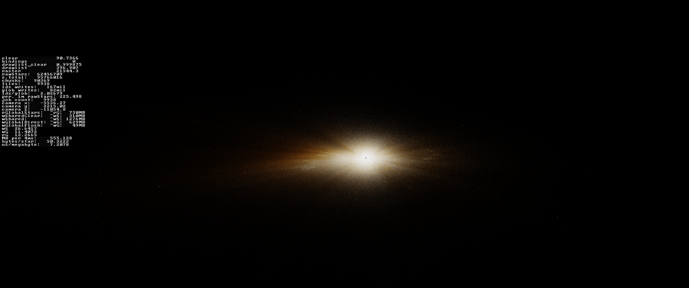
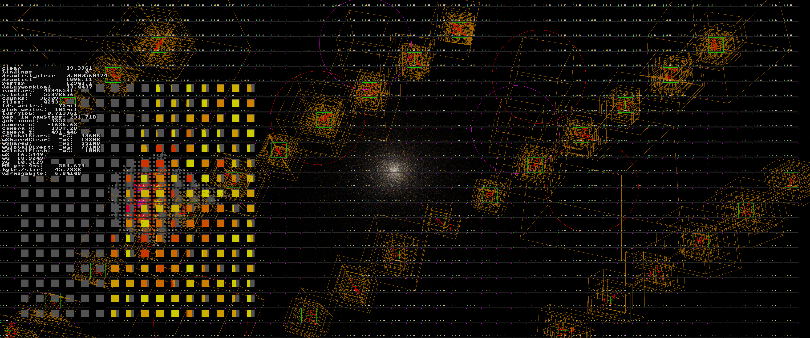

# star-rendering (Preview)
Large-Scale realtime GPU-driven compute shader point cloud rendering for star visualization. This Repo represents a preview version, some additional documentation and data fetching scripts will be included later.

